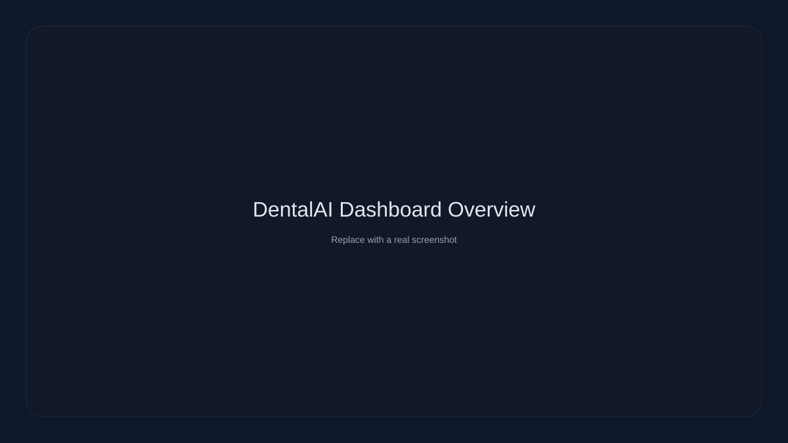
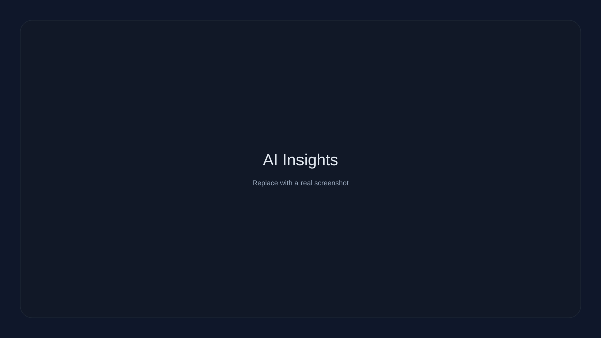
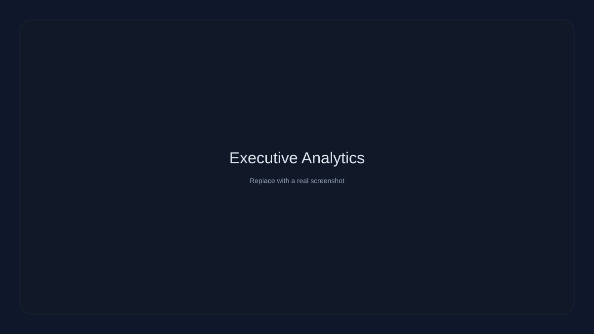
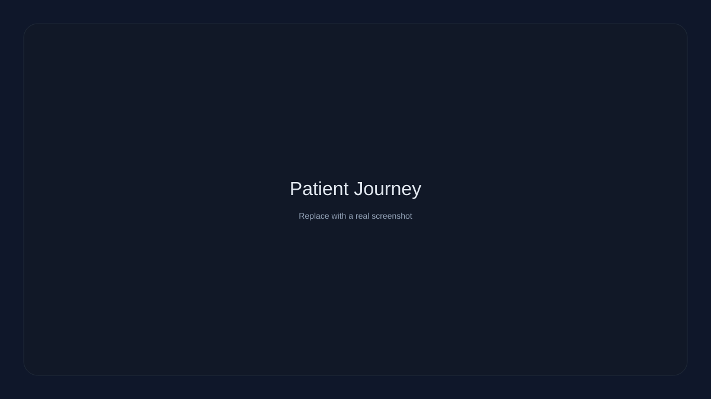
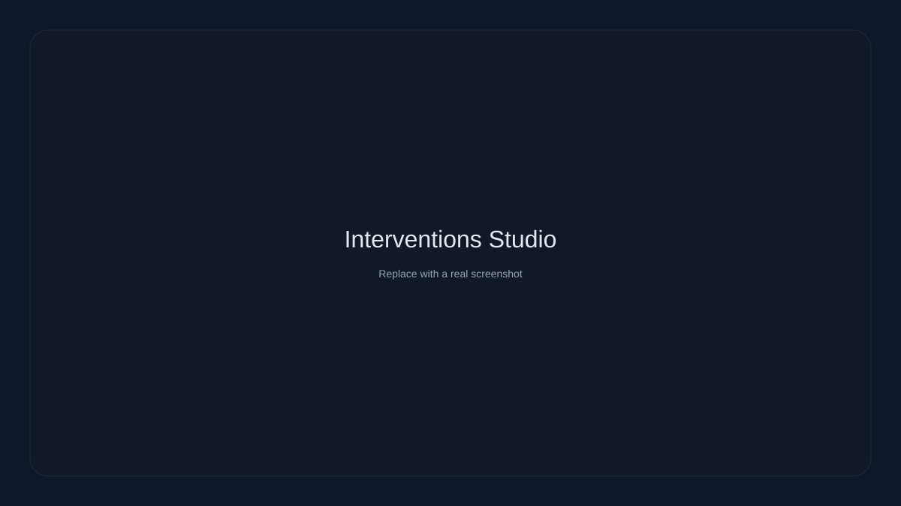

# DentalAI

Operational AI platform for dental treatment adherence, interventions, and clinical intelligence.

DentalAI combines predictive risk modeling, intervention automation, and executive analytics with a production-style architecture for research and demo showcases.

## Highlights

- Predictive dropout risk with SHAP explainability
- Automated intervention workflows and delivery tracking
- Patient journey intelligence with adherence scoring
- Executive analytics dashboards and cohort comparison
- PWA-ready UI with polished SaaS aesthetics

## Architecture

- Frontend: React + Vite + Tailwind + shadcn/ui
- Backend: Django 5 + DRF + JWT + Celery
- Data: PostgreSQL
- Queue: Redis
- ML: scikit-learn + XGBoost + SHAP

See documentation:
- docs/architecture.md
- docs/diagrams.md
- docs/api.md
- docs/deployment.md
- docs/research.md

## Screenshots (placeholders)







## Quick start (local)

### Backend

```
cd backend
python3 -m venv .venv
source .venv/bin/activate
pip install -r requirements.txt
cp .env.example .env
python manage.py migrate
python manage.py runserver
```

API: http://localhost:8000/api/v1/

### Frontend

```
cd frontend
npm install
cp .env.example .env
npm run dev
```

App: http://localhost:5173

## Demo data

Seed curated hero patients and realistic analytics data:

```
cd backend
python manage.py seed_demo_data
```

## Deployment

Production templates and scripts:
- backend/.env.production.example
- frontend/.env.production.example
- scripts/run_backend_prod.sh
- scripts/run_celery_worker.sh
- scripts/run_celery_beat.sh
- scripts/build_frontend.sh

Full guide: docs/deployment.md

## AI workflow summary

1. Feature builder extracts behavioral signals
2. Model inference produces risk tier and probability
3. SHAP explanations provide top drivers
4. Automation queues interventions for high-risk patients
5. Analytics aggregate risk, outcomes, and engagement

## API documentation

docs/api.md includes endpoint descriptions, auth flows, and RBAC summary.

## Research summary

docs/research.md covers methodology, evaluation, and explainability.

## License

Research use — INAHS 2026 Paper #110.
