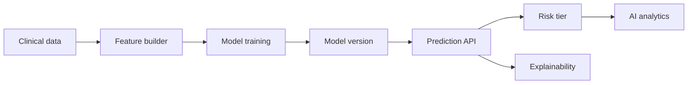
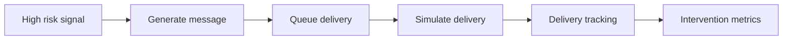
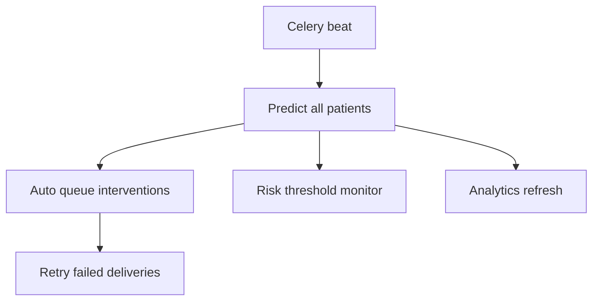
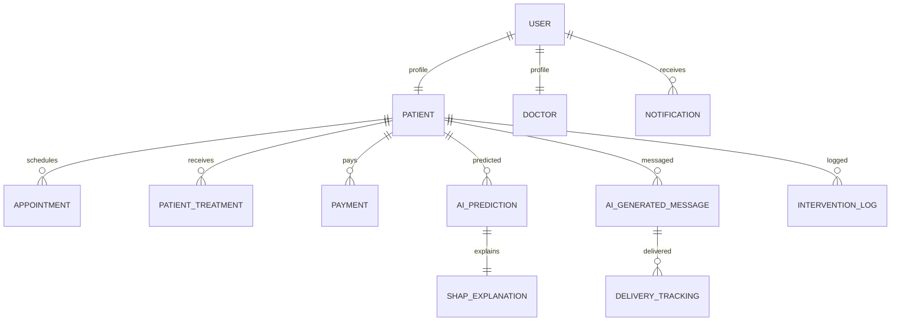

# Architecture Diagrams

## System architecture

```mermaid
graph TD
  U[Users] --> FE[Frontend (React/Vite)]
  FE --> API[Django API]
  API --> DB[(PostgreSQL)]
  API --> REDIS[(Redis)]
  API --> ML[Model Registry]
  REDIS --> CELERY[Celery Workers]
  CELERY --> API
  API --> NOTIF[Notifications]
  API --> LOGS[Audit Logs]
```

## AI workflow



## Intervention workflow



## Automation workflow



## Database relationships


